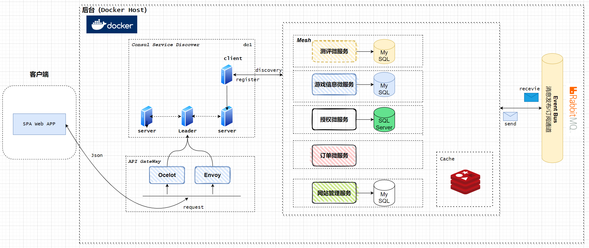

# .NET Microservices Application
基于微服务架构，可容器化思想设计的游戏测评网项目。

## 系统架构图


# 运行方式
首先确保你[安装](https://docs.docker.com/docker-for-windows/install/)Docker并配置了[WSL](https://docs.docker.com/desktop/windows/wsl/)环境。然后, 在 `evaluationSiteOnContainers` 的 **/src/** 目录下启动命令行(CommandLine)。按照顺序执行以下参数：

```powershell
docker compose build
docker compose up
```
稍等片刻后执行以下命令查看容器状态：

```powershell
docker ps
```


你也可以通过健康检查和服务注册来查看服务是否正常启动：
# 运行状态
你也可以通过URL访问健康检查和服务注册来查看服务是否正常启动及注册成功：

```
服务健康检查 : http://localhost:5106
服务注册中心 : http://localhost:8500
```

## 健康检查


## 服务注册发现


## 各服务地址（暴露端口供Swagger文档访问）

```
游戏测评服务 : http://localhost:5100
游戏资料服务 : http://localhost:5101
游戏订购服务 : http://localhost:5102
后台管理服务 : http://localhost:5104
授权认证服务 : http://localhost:5105/swagger
```

# 网关建设
本服务使用Ocelot网关以及Enovy网关代理（开发ing），本服务所附带的Vue项目，前台以及后台都使用Ocelot网关访问服务，不要使用上面暴露的端口访问服务，因为它们只是供开发debugg使用。

## 网关地址
```
Ocelot: http:localhost:20000/
Enovy: http:localhost:10000/
```
## 网关上下游对应关系：

```
http:localhost:20000/v1/e/{everything}
to 
http:evluation-api//evaluation-api/api/v1/{everything}

http:localhost:20000/v1/g/{everything}
to 
http:gamerepo-api//gamerepo-api/api/v1/game/{everything}

http:localhost:20000/v1/s/{everything}
to 
http:gamerepo-api//gamerepo-api/api/v1/shop/{everything}

http:localhost:20000/v1/o/{everything}
to 
http:ordering-api//ordering-api/api/v1/order/{everything}

http:localhost:20000/v1/b/{everything}
to 
http:backmanage-api//backmanage-api/api/v1/back/{everything}

http:localhost:20000/v1/u/{everything}
to 
http:identity-api//identity-api/api/v1/user/{everything}
```
